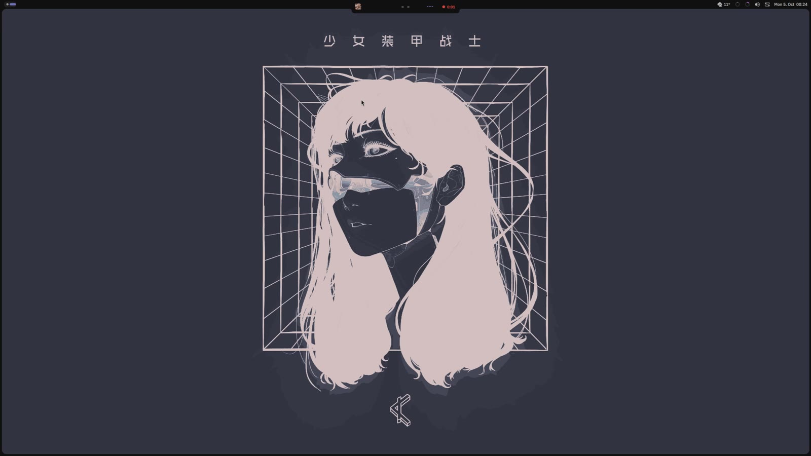
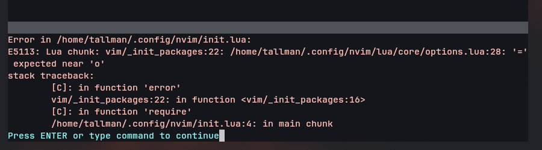
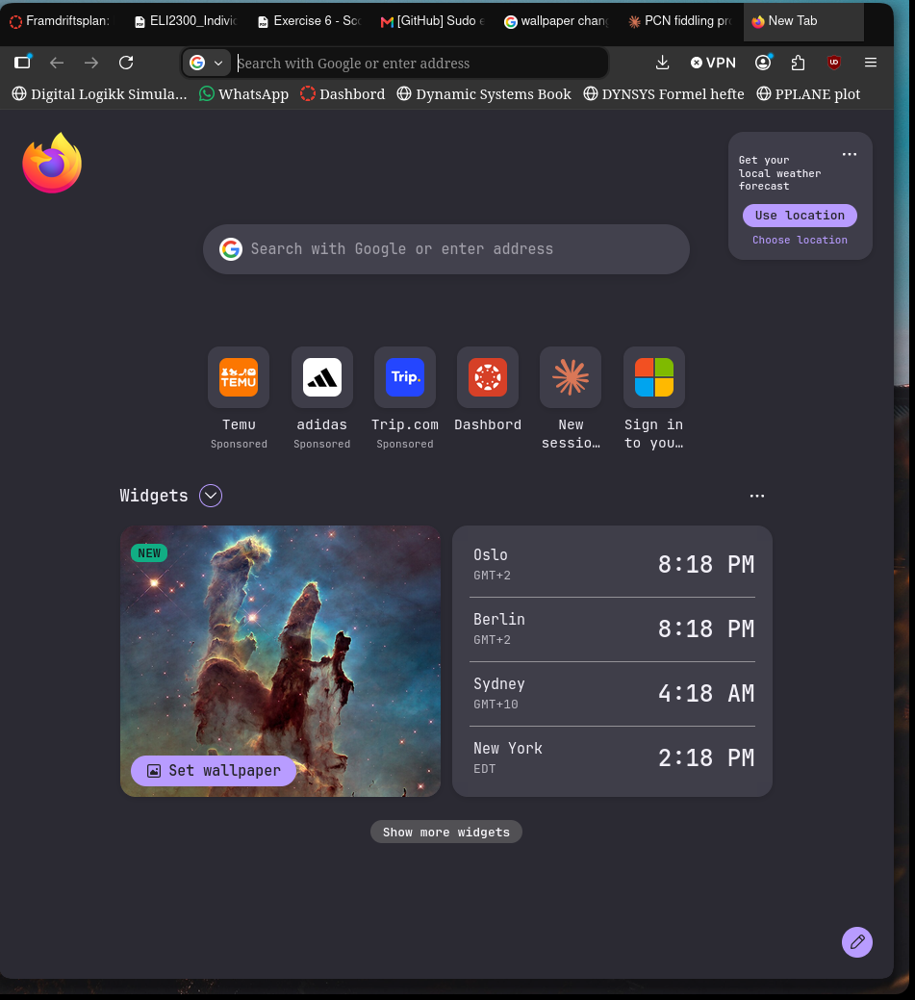

# Blink

Still work in progress hobby project!!!

A macOS-inspired desktop for Hyprland, built with Quickshell. Black frame, a notch with a face,
and everything grows out of the bar.

## Showcase
[](screenshots/showcase.mp4)

*Click the picture to watch the video (1:12).*





<p align="center">
  
</p>

## Features
- **Notch** with a face that reacts (sleepy at night, happy when charging, surprised on screenshots), music, file tray, notifications, timetable and buses
- **Dynamic Island** style volume and brightness, next class countdown
- **Control Center** that grows out of the frame: Wi-Fi, Bluetooth, modes, sliders, battery and power profiles, screen recording
- **Modes**: Do Not Disturb, Focus and Game Mode
- **Bar sheets**: calendar, weather (MET Norway) and per-app sound
- **Launcher**, Alt+Tab switcher and Mission Control
- **Lock screen** and **SDDM login** that match the shell
- **Accent color** taken from the wallpaper
- **Notifications** in the notch, or as cards that grow out of a corner of the frame (expand, swipe away, reply)
- **Settings app** with search, a deep Hyprland page, and Wi-Fi that also handles Eduroam-style logins
- Screen recording (whole screen or an area), wallpaper picker with slideshow, hot corners

## Requirements
- Arch Linux based distribution
- Hyprland 0.56+ (Lua config)
- Quickshell 0.3+
- The installer handles the rest!

## Install
```
git clone https://github.com/turbogoomba/blink ~/Documents/GitHub/blink
cd ~/Documents/GitHub/blink
./install.sh
```
Log out and back in when it is done.

## Keybinds
| Keys | Action |
|---|---|
| Super + Space | Launcher |
| Super + Tab | Mission Control |
| Alt + Tab | Switch windows |
| Super + W | Wallpaper picker |
| Super + T | Tiling / floating |
| Super + Escape | Lock |
| Print | Screenshot |
| Super + Shift + R | Screen recording |

## Structure
```
hypr/        Hyprland config (Lua)
quickshell/  The shell: bar, notch, dock, control center, services
sddm/        Login screen theme
apps/        Firefox, Spotify and Vesktop themes
systemd/     Blink shell service
```
